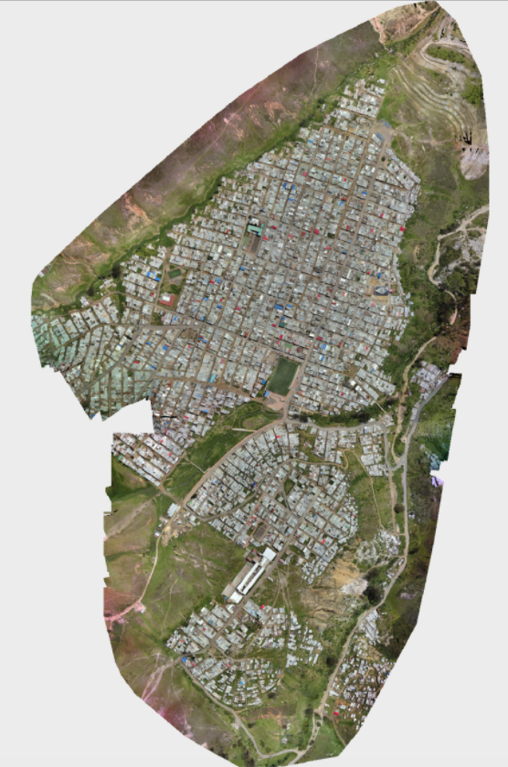

# Final Project Description

### Tammy Glazer and James Jensen

## Project Background

Since the mid-1990s, floods, storms, and earthquakes have made up nearly 80% of natural disasters around the world. Increasing global surface temperatures are leading to rising sea levels and the evaporation of excess water vapor into the atmosphere, increasing the likelihood of weather-driven disasters. As a direct result, locations including the Caribbean, Central America, the South Pacific, and the Himalayas face an elevated risk of experiencing natural hazards. While a variety of government and development organizations support emergency management and the provision of relief services, far less is being done by way of risk reduction and the development of data-driven resource prioritization strategies.  
  
In the face of a natural hazard, roof design, condition, and material contribute to household resilience. The traditional approach to identifying high-risk buildings and roofs in disaster prone locations involves going door-to-door to visually inspect building conditions, which can be extremely costly and time consuming. For instance, for windstorm mitigation inspections, an inspector will look for construction features that have been shown to reduce losses in hurricanes, such as concrete blocks, the presence of roof-to-wall attachments, and opening protections. An alternative approach would be to use high-resolution drone imagery to quickly identify, and in turn prioritize areas with problematic building materials. According to DrivenData, “Mapping a 10km2 neighborhood with a drone can be done within a matter of days and at a cost of a few thousand dollars at most” (2019).  
  
Earlier this year, we took a course in Unsupervised Machine Learning and used our final project as an opportunity to apply computer vision methods to address this challenge. Specifically, over the course of the quarter, we leveraged high definition, satellite imagery to identify and label rooftops by their construction materials. It was our hope that a successful labeling strategy for aerial imagery would facilitate the prioritization of building inspections in St. Lucia, Guatemala, and Colombia, thereby ensuring community resilience in high risk locations. We were specifically interested in how unsupervised learning techniques could be used to derive rooftop material labels when training data are unavailable.  

## Computing Challenges

The data consist of seven satellite images at 4cm resolution stored as Cloud Optimized GeoTIFFs (COGs), totaling over 60 GB, as well as accompanying building footprints stored as GeoJSONs. All data are provided by WeRobotics and the World Bank Global Program for Resilient Housing. COGs can be hosted and accessed on an HTTP server. They have the potential to enable efficient workflows since HTTP get range requests can draw only upon necessary parts of each file. Without prior knowledge of large-scale computing strategies, however, we previously completed coordinate transformations, image masking and segmentation, image pre-processing, and feature generation serially. Further, we completed the entire analysis on our personal machines using locally stored images, making it difficult to share insights and access the data remotely. As a result of these challenges, accessing and downloading the data took approximately 6 hours, and data processing took well over 40 hours to complete.  

## Social Science Research Question

Our Social Science Research Question is the following: Can large-scale computing strategies be leveraged to expedite high-resolution satellite image acquisition and pre-processing to facilitate machine learning and improve disaster preparedness?  
  
Using large-scale computing strategies, we seek to parallelize a majority of computer vision related data acquisition, pre-processing, and image preparation tasks to expedite a machine learning pipeline. In the case of an imminent natural emergency, it is critical that organizations be able to quickly target buildings for inspection as a disaster risk reduction strategy. A streamlined data processing workflow will enable our time-sensitive models to be productionized, thereby supporting humanitarian organizations and ensuring community resilience.  

## Large-Scale Computing Approaches

### Data Transfer & Sharing

To expedite feature generation, we are able to incorporate a variety of new techniques into our data processing workflow. We begin by using a multi-part uploading technique (TransferConfig) to concurrently upload 7 large tif files to an AWS S3 bucket, ranging from 1.65 to 9.96 GB in size. Multi-part transfers are necessary when an individual file size exceeds a specified S3 bucket threshold, which we encountered. We were able to tune the maximum number of concurrent S3 API transfer operations based on our connection speed using the max_concurrency attribute.  
  
Next, we leverage a multi-threading technique (ThreadPool) to upload 7 GeoJSONs to the same AWS S3 bucket. This is a parallel approach that allows us to run multiple threads of execution within an operating system, thereby maximizing the capacity of available CPUs. As a result of these operations, we are able to access all necessary files using Boto3, the AWS SDK for python.  

### Image Pre-Processing
  
For the remainder of our project, we parallelize image access, pre-processing, and feature generation for our machine learning pipeline using pywren on top of AWS Lambda. We selected this approach for several reasons, including that it is optimized for computational imaging, event-driven, and because it is a serverless solution that automatically manages underlying compute resources. We begin by using pywren to access the GeoJSONs from the S3 bucket in parallel. GeoJSONs represent individual building footprints, and store information such as the building ID, roof material (for testing), and coordinates outlining each individual structure. Next, we use pywren to extract an abbreviated dictionary of relevant information about each rooftop in parallel.  

We then execute an affine transformation on the coordinates embedded within each dictionary based on the coordinate reference system in the building’s corresponding tif file. We perform this step because coordinates map differently on different locations of the world based on the earth’s natural curvature. While we had hoped to perform this in parallel, we discovered that it is very challenging to bring non-native python packages into AWS Lambda and therefore decided to conduct this step serially using pyproj. Currently, importing a  package to Lambda involves zipping up a Lambda function and Linux compatible dependencies, or uploading dependencies to Lambda Layers, which are both beyond the scope of this course.  

### Image Segmentation
  
Following this step, we extract pixel-value arrays for each satellite band of an image given a dictionary containing the transformed coordinates for each rooftop. Each band contains information on surface reflectance from different ranges of the electromagnetic spectrum. In this case, each file contains four bands. Within each band matrix, each value represents a pixel and is assigned a number from 0-255, with larger numbers representing more of that color. Again, while we had hoped to perform this step using AWS Lambda, we discovered that there is a 512 MB maximum temporary storage limit for files on Lambda, and the tif files significantly surpass this limit. We explored and experimented with solutions such as leveraging a rasterio plugin called rio-tiler or lambda-tiler to pull in individual Mercator tiles from COGs as needed, but unfortunately could not transform the provided coordinates into Mercator values to accomplish this task. In the future, this would be an interesting approach to pursue.  

### Feature Generation
  
Once we have a matrix representing each rooftop, we then parallelize image pre-processing and feature generation. Specifically, we use pywren to send each image array to an AWS Lambda function to crop images to consistent sizes and calculate metrics such as zonal statistics for each image band. This process is embarrassingly parallel and thus ideal for a serverless solution. Dictionaries are returned containing feature values as well as each construction material label for evaluation purposes. Finally, feature sets are assembled into a pandas DataFrame that can be fed directly into our unsupervised machine learning pipeline.  

## Findings

-How many rows?  
-How long does this take?  
-Graph comparing compute speed? What is our benchmark for success?  

